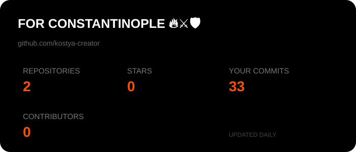

# Hello everyone 👋

### My name is Constantine I, and I want to make Constantinople great again through open source, so grab your spears and let's go get revenge on the Crusaders.

Okay, enough with the stupid jokes ;)))))))))))))

### My name is the humble Kostya. I'm just getting into software development and trying to figure out what the hell is going on in this universe where I work until 2 AM and then have to go to school in the morning. (God, that's disgusting, just thinking about 9th grade again.)

Other than that, I'm very new to development — only 20 years of vibe coding and 40+ years of programming on an electronic computing machine 🤖

Okay, I'm lying I'm 16 (Terminators)

### I used to be into video editing and design, and that's how I realized I absolutely love creating interesting things. But I burned out. (I used to make money freelancing. Ah, those were good times.)

And one more very important piece of information: I'm gay (no).

### If you're an employer / manager / businessman and you're reading this:

# PLEASE HIRE ME 0/7 (0 days working, 7 days resting). I'll even name my son after you. Please 🥺🐧

### Hopefully, I'll make lots of new friends 🙂

Contacts:  
Telegram: @konstantindimitriev

(If you don't have Telegram, sorry, I guess we're not meant to be. You can message me on X though — I check it once every six months https://x.com/DimitrievK80301)

# FOR CONSTANTINOPLE 🔥⚔️🛡️

